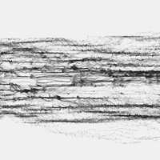
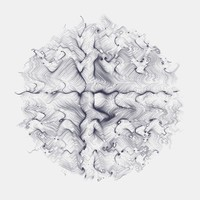
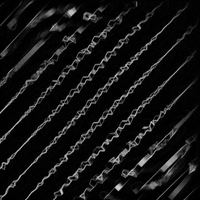
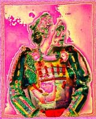
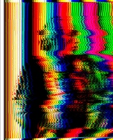
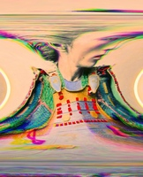

# clojure2d

Clojure2D is a lightweight library supporting generative coding or glitching. It's based on Java2D directly. It's Clojure only, no ClojureScript version.










## Documentation

[Github.io](https://clojure2d.github.io/clojure2d/)

[Marginalia - In progress!](https://clojure2d.github.io/clojure2d/docs/marginalia/toc.html)

[Codox - In progress!](https://clojure2d.github.io/clojure2d/docs/codox/)

## Motivation

This project is the answer to personal needs to optimize my own workflow for generative or glitch creations. I've been producing a lot of Processing code and started to suffer from limitations of working in 'write sketch and run' mode. Too much copy&paste between sketches, zillions of folders, zillions of processed images. And one day I fell in love with FP. This code is the answer.

### What's wrong with Processing?

* not reusable code - you have to copy your common parts between sketches
* display and canvas coupling
* weak or no support for parallelism
* more minor...

### Why not use...

... quil, thi.ng, clisk, possibly other?

The main reason was that I wanted to learn Clojure making something from the scratch. Quil is still Processing. Thi.ng was to complex to me at the beginning (but I plan to investigate what can be usable).

### What's special in this library then?

In points:

* Almost decoupled display and canvas (decoupled drawing and refreshing) - you can have as many windows as you want, you can have as many canvases as you want. Display repaints selected canvas automaticaly in separate thread. This way you can operate on canvas in your pace.
* Processing way is still possible (you can attach draw() function to your Display). However main benefit here: draw function keeps context between invocations, this way you can avoid global state (atoms etc.) and write more functional way. The same is for events, each Window has assigned state which is passed through event calls.
* Easy live coding possible (Emacs/Cider/REPL), 'notebook' way of making
* FastMath as main math library
* Main focus on higher level generative/glitch concepts (like sonification support, vector field functions, colorspace operations, things like pixelsorting, slitscan etc. See my Processing sketches, link below)

Check out examples and results folders

### What's odd?

It's kind of personal library which supports my (probably not optimal, not convenient for others) way of creating stuff.
There are still plenty of bugs and not idiomatic code. It may be slower than Processing. Eats a lot of memory (Pixels code is generally immutable). Still not stable API and architecture.
No tests (yet)

## Installation

Add following line as a dependency to your `project.clj`

```clojure
[clojure2d "0.0.4-SNAPSHOT"]
```

## Usage

Since still no docs are available, check out prepared examples. All available packages are described below.

### clojure2d.core [docs](https://clojure2d.github.io/clojure2d/docs/marginalia/clojure2d.core.html)

This is main namespace with functions in three groups:

* image file oparations (load/save); jpg, png and bmp
* canvas operations (wrapper for Java2D BufferedImage and Graphics2D)
* display and event operations (JFrame wrapper)
* session handling (logger + unique, sequential filename generator)

### clojure2d.pixels [docs](https://clojure2d.github.io/clojure2d/docs/marginalia/clojure2d.pixels.html)

Pixels type as a representation of channel values of the image plus operations on pixels.
Defines also:

* pixel filters (blur, erode, dilate, median, threshold, posterize, tint)
* blending (composing) function of two Pixels
* functions which operate on Pixels parallelly (filter-channels, blend-channels)
* accumulation bins (smooth rendering helper)

### clojure2d.color [docs](https://clojure2d.github.io/clojure2d/docs/marginalia/clojure2d.color.html)

* colorspace converters
* collection of blending basic functions (like add, subtract, divide, difference, etc.)
* palette generation / color reducing filter

### clojure2d.math [docs](https://clojure2d.github.io/clojure2d/docs/marginalia/clojure2d.math.html)

* FastMath (jafama) bindings
* statistic functions

Additionally in following namespaces:

* clojure2d.math.complex - Complex (Vec2) operations (code taken from Apache Commons Math) [docs](https://clojure2d.github.io/clojure2d/docs/marginalia/clojure2d.math.complex.html)
* clojure2d.math.vector - Vec2, Vec3 and Vec4 types and operations on vectors [docs](https://clojure2d.github.io/clojure2d/docs/marginalia/clojure2d.math.vector.html)
* clojure2d.math.joise - Joise library bindings (basic (simplex/perlin/value), cell (voronoi) and fractal noise + combinations) [docs](https://clojure2d.github.io/clojure2d/docs/marginalia/clojure2d.math.joise.html)
* clojure2d.math.random - Random functions and perlin noise from flow-noise library [docs](https://clojure2d.github.io/clojure2d/docs/marginalia/clojure2d.math.random.html)

### clojure2d.extra

This is namespace for common generative/glitch specific libraries:

* signal - signal processing, wave generators, effects and filters (sonification enabler) [docs](https://clojure2d.github.io/clojure2d/docs/marginalia/clojure2d.extra.signal.html)
* overlays - 3 overlays (noise, spots and rgb scanlines) to finish your images [docs](https://clojure2d.github.io/clojure2d/docs/marginalia/clojure2d.extra.overlays.html)
* segmentation - segment Pixels into rectangles [docs](https://clojure2d.github.io/clojure2d/docs/marginalia/clojure2d.extra.segmentation.html)
* variations - vector field functions / variations taken from fractal flames world [docs](https://clojure2d.github.io/clojure2d/docs/marginalia/clojure2d.extra.variations.html)
* glitch - glitching filters
* raymarching - simple ray marching 3d scene renderer

## Examples

I've prepared several examples with results where you can check current state of the library and learn how it works. 

* ex01 - display window and process basic events (key and mouse)
* ex02 - simulate Processing draw() function
* ex03 - simple generative example
* ex04 - noise functions visualization
* ex05 - particle drawing
* ex06 - noise generative examples
* ex07 - more noise
* ex08 - folds code (http://folds2d.tumblr.com/)
* ex09 - curvature from noise (https://generateme.wordpress.com/2016/05/04/curvature-from-noise/)
* ex10 - second variant of curvature
* ex11 - pixel filters and image blending (composing)
* ex12 - 3 overlays
* ex13 - image segmentation example
* ex14 - metaballs animation (https://gist.github.com/yogthos/3411106)
* ex15 - colorspace converters + equalize histogram
* ex16 - signal processing, sonification examples
* ex17 - generative grids
* ex18 - wave generator visualizations
* ex19 - glitch filters: slitscan, channels shift, mirror image
* ex20 - color reduction examples
* ex21 - Pickover's popcorns
* ex22 - ray-marching 3d example
* ex23 - ray-marching 3d example (using SDF ray marching functions from extra/raymarching namespace)
* ex24 - triangle stripe
* ex25 - Gaussian Free Field
* ex26 - FreeArt-Source live coding result (http://subsite.hr/2017/03/performans-silent-coding-u-okviru-izlozbe-free_art_-_source/)
* ex27 - color palette generator
* ex28 - double pendulum (with https://github.com/littleredcomputer/sicmutils/blob/master/src/sicmutils/examples/double_pendulum.clj)
* ex29 - 2d chaotic maps
* ex30 - random or low discrepancy sequences
* ex31 - wavy lines
* ex32 - harmonograms on noise (accumulation bins rendering)
* ex33 - interpolations / easings
* ex34 - ducks and kalisets explorer
* ex35 - mandelbrot and julia explorer
* ex36 - spirograph
* NOC - [Nature of Code](https://github.com/shiffman/The-Nature-of-Code-Examples/) Clojure2d version

## TODO

### High priority

* Marginalia docs + github.io page - in progress
* Cleaning, optimizations - still in progress (more profiling, boxed math)
* ~~Parallel color operations on Pixels~~
* ~~Color namespace cleaning~~
* ~~Colorspace converters~~
* More in extra ns:
  - SDF objects
  - variations
  - glitch filters in extra namespace (moved from Processing)
  - analog filters (for sonification part)
* Canvas drawing functions (PShape implementation - partially done)
* ~~Session handling (saving results in session, logging actions) - done, not tested~~
* Sanity tests

### Low priority or ideas

* Cheat sheet
* More window events
* Deeper joise bindings
* Wavelets bindings
* Tests...

## Community

[Clojurians](https://clojurians.slack.com/archives/clojure2d)

### How to support

Yes! You can help with this project:

* Beginners:
  - create more variations
  - ~~create colorspace converters~~
  - create pixel filters
  - create analog (audio) filters
* Advanced:
  - speed optimizations
  - idiomatic clojure fixes

Discuss about it with me on Slack.
Or just Pull Request.

## Projects / links

* [Processing glitch/generative projects](https://github.com/tsulej/GenerateMe)
* [Visual log](http://generateme.tumblr.com)
* [Folds project](http://folds2d.tumblr.com)
* [Articles](https://generateme.wordpress.com)
* [Facebook 1](https://www.facebook.com/generateme)
* [Facebook 2](https://www.facebook.com/folds2d)
* [Twitter](https://twitter.com/generateme_blog)

## License

Copyright © 2016-2017 GenerateMe
Distributed under the MIT Licence
